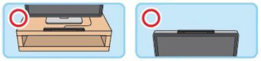

# dbar4gun 0.18.2

dbar4gun is a Linux userspace driver for the wiimote with DolphinBar support, specifically designed to function as 4 light guns.

[](https://www.buymeacoffee.com/lowlevel.1989)

## Recommendation

We recommend using DolphinBar as the main controller because, in mode 4, the bar stays on until we turn off the Wiimote. This way, we avoid having to manually connect or disconnect the USB every time we want to play with the Wiimote.

It is important to remember to disconnect the Wiimote using the power button at the end of playing to increase the lifespan of the infrared LEDs.

***for more precision, place the sensor bar over the screen***

## Feature support

- Only DolphinBar in mode 4
- N Mayflash Dolphinbar
- 4 wiimote x Dolphinbar (very fast with a single bar)
- Bluetooth
- wiimote with individual buttons
- multiplayer
- nunchuck
- tilt correction
- calibration two points
- calibration three points
- Standard configuration for Wii sensor
- wiimote led -> index mouse
- auto key
- systemd
- Smoothed cursor
- setup ir as Component
- calibration as Component
- Generic wiimote
- works on linux
- works on retropie
- works on raspbian



| device   | button    | map           | only cursor          | shared        | mame default                      |
|----------|-----------|---------------|----------------------|---------------|-----------------------------------|
| wiimote  | ir        | mouse cursor  | same                 | false         | cursor                            |
| wiimote  | a         | auto key      | btn a    (Bluetooth) | false         | bomb                              |
| wiimote  | b         | mouse left    | same                 | false         | trigger                           |
| wiimote  | home      | key enter     | btn home (Bluetooth) | true / false  | select                            |
| wiimote  | 1         | mouse middle  | btn 1    (Bluetooth) | false         |                                   |
| wiimote  | 2         | mouse right   | btn 2    (Bluetooth) | false         | reload (retroarch)                |
| wiimote  | plus      | auto key      | key next (Bluetooth) | false / true  | start                             |
| wiimote  | minus     | auto key      | key prev (Bluetooth) | false / true  | 1 coin                            |
| wiimote  | d-pad     | auto key      | arrows   (Bluetooth) | false / true  | direction                         |
| nunchuck | stick     | wiimote d-pad | abs hat  (Bluetooth) | false         | direction                         |
| nunchuck | z         | auto key      | btn z    (Bluetooth) | false         |                                   |
| nunchuck | c         | auto key      | btn c    (Bluetooth) | false         |                                   |
| combo    | b + home  | key tab       | same                 | true          | menu (mame,flycast)               |
| combo    | b + plus  |               | same                 | false         | disable/enable ir (useful in gui) |
| combo    | b + minus | key esc       | same                 | true          | exit (retroarch)                  |
| combo    | b + 1     | key space     | same                 | true          | fast forward                      |
| combo    | b + 2     | key 2         | same                 | true          | start (P2)                        |
| combo    | a + home  | key f1        | same                 | true          | menu (retroarch)                  |
| combo    | a + plus  |               | same                 | false         | start calibration                 |
| combo    | a + minus |               | same                 | false         | reset calibration                 |


## Known Issues

### 1. Failure of IR LEDs on the DolphinBar

**Issue:** The DolphinBar has infrared LEDs that can burn out easily, making it impossible to aim correctly.  
**Solution:** Replace the damaged LEDs or swap the bar for a new one.

### 2. I can move the pointer, but I can't shoot

**Issue:** If you can move the pointer but can't shoot, the driver may be detecting a keyboard or mouse as a second light gun.  
**Solution:** Change the "mouse index" in the emulator settings to match the light gun's index and avoid conflicts.

~~~
wiimote led 4  -> mouse index 0 or VirtualGun 01
wiimote led 3  -> mouse index 1 or VirtualGun 02
wiimote led 2  -> mouse index 2 or VirtualGun 03
wiimote led 1  -> mouse index 3 or VirtualGun 04
~~~

### 3. The pointer becomes unstable for no apparent reason

**Issue:** The pointer moves erratically for no apparent reason.  
**Possible Cause:** Sunlight entering the room interferes with the infrared sensor.  
**Solution:** Confirm the issue by entering the "Debug" option in the driver settings within RetroPie Setup.

### 4. Calibration issues

**Issue:** Difficulties in calibrating the Wiimote properly.  
**Possible Causes:**
- You are too close to the TV.
- If using DolphinBar, one of the IR LEDs may be damaged.  
  **Solution:** You can check the behavior of the calibration points using the "Debug" option in RetroPie Setup.

## Calibration wherever

### mode 2 (default)
- **Initiate Calibration:** Press the **A + plus** buttons simultaneously. When LED 1 light up, calibration has begun.
- **Step 1:** Shoot at the **top-left** corner of the screen. LED 4 will light up.
- **Step 2:** Shoot at the **top-right** corner of the screen. LEDs 2 adn 3 light up.
- **Step 3:** Shoot at the **bottom-center** of the screen.

### mode 1
- **Initiate Calibration:** Press the **A + plus** buttons simultaneously. When LED 2 and 3 light up, calibration has begun.
- **Step 1:** Shoot at the **center** of the screen. LEDs 1 and 4 will light up.
- **Step 2:** Shoot at the **top-left** corner of the screen.

Once you've completed these steps, your Light Gun will be calibrated and ready to us  
## Light Gun Configuration Manual for Specific Core Ga   
Refer to the [specific README for light gun configuration](retroarch) to ln how to configure games in RetroArch.
  
## List of No-Crosshair Games: Perfect Performance with wiimote (tested)   
    
| game                     | system     | ir setup       | smoothing level | note                           |
|--------------------------|------------|----------------|-----------------|--------------------------------|
| Operation Wolf           | Mame       | Standard       |  0              |                                |
| Point Blank              | Mame       | Standard       |  0              |                                |
| Point Blank 2            | Mame       | Standard       |  0              |                                |
| Point Blank 3            | Mame       | Standard       |  0              |                                |
| Ghoul Panic              | Mame       | Standard       |  0              |                                |
| Time Crisis              | Mame       | Standard       |  0              |                                |
| Golly! Ghost!            | Mame       | Standard       |  0              |                                |
| VS. Hogan's Alley        | Mame       | Standard       |  0              | low precision in the bonus     |
| Lucky & Wild             | Mame 2015  | Standard       |  0              |                                |
| Area 51                  | Mame 2003+ | Standard       |  0              |                                |
| House of the Dead 2      | Dreamcast  | Standard       |  0              |                                |
| Virtua Cop 2             | Dreamcast  | Standard       |  0              |                                |

## Memory Consumption of the dbar4gun

Currently, the dbar4gun consumes ~24 MB. For each Wiimote connected via Bluetooth, an additional ~19 MB is consumed, as a dedicated process is generated to manage each Wiimote.

In the case of the DolphinBar, it is detected as four Wiimotes, even if they are not connected, resulting in an additional consumption of ~76 MB.

### Summary of Memory Consumption

| Item                                  | Memory Consumption |
|---------------------------------------|--------------------|
| dbar4gun                              | ~24 MB             |
| monitor                               | ~19 MB             |
| Per Wiimote connected via Bluetooth   | ~19 MB             |
| DolphinBar (detected as 4 Wiimotes)   | ~76 MB             |

If the address of your wiimote(s) is already known (e.g. `/dev/hidraw0`), it can be attached directly using the `attach` subcommand. In that case, the monitor is not needed, and memory consumption is reduced drastically.

| Item                                  | Memory Consumption |
|---------------------------------------|--------------------|
| dbar4gun attach                       | ~24 MB             |

## To Do

1. Calibration ( high priority always )
2. Class Log System
3. diamond ir setup
4. square ir setup
5. calibration gui with training target
6. unit test

## Install with RetroPie-Setup

### Download dbar4gun installer

```
cd ~/RetroPie-Setup/scriptmodules/supplementary
curl -LO https://raw.githubusercontent.com/lowlevel-1989/dbar4gun/master/retropie/dbar4gun.sh
```

### Open RetroPie-Setup

```
*Manage packages \~ driver \~ dbar4gun \~ Install*  
```

### Run service

```
*Manage packages \~ driver \~ dbar4gun \~ Configuration \~ Enable/Restart dbar4gun*  
```

### Stop service
```
*Manage packages \~ driver \~ dbar4gun \~ Configuration \~ Disable dbar4gun*  
```

### Status service
```
systemctl status dbar4gun
```

### Bluetooth

You have a Raspberry Pi 3 or for Raspberry Pi 2 and below, you need a Bluetooth dongle (sometimes called Bluetooth adapter). For a list of dongles known to work with Raspberry Pi see [https://elinux.org/RPi_USB_Bluetooth_adapters#Working_Bluetooth_adapters](https://elinux.org/RPi_USB_Bluetooth_adapters#Working_Bluetooth_adapters) ).

[adding-a-bluetooth-controller-to-retropie](https://retropie.org.uk/docs/Bluetooth-Controller/#adding-a-bluetooth-controller-to-retropie)

## Install manually

### System dependencies

- git
- python >= 3.7
- bluez >= 5.0

### Python dependencies

- evdev>=0.3.0
- pyudev>=0.16

### Steps with root

#### build

```
cd dbar4gun
python -m venv $(pwd)
source $(pwd)/bin/activate
pip install $(pwd)
```

### Use

#### help service
```
usage: dbar4gun [-h] [--calibration {0,1,2}] [--setup {1}] [--width WIDTH] [--height HEIGHT] [--only_cursor] [--disable-tilt-correction] [--port PORT]
                [--smoothing-level SMOOTHING_LEVEL]
                {start,attach,stop,version,gui} ...

dbar4gun is a Linux userspace driver for the wiimote with DolphinBar support,
specifically designed to be small and function as 4 light guns.

positional arguments:
  {start,attach,stop,version,gui}

options:
  -h, --help            show this help message and exit
  --calibration {0,1,2}
                        
                        mode
                        0: disabled
                        1: Center,  TopLeft
                        2: TopLeft, TopRight, BottomCenter (default)
  --setup {1}           
                        mode
                        1: Standard (sensorbar, dolphinbar)
  --width WIDTH         1920
  --height HEIGHT       1080
  --only_cursor
  --disable-tilt-correction
  --port PORT           35460
  --smoothing-level SMOOTHING_LEVEL
                        3 (default)
```

#### run service with root
```
dbar4gun start --width 1920 --height 1080
```

#### restart service with root

```
dbar4gun start --width 1920 --height 1080
```

#### check version

```
dbar4gun version
```

####  debug calibration gui
```
dbar4gun gui
```

#### stop service with root

```
dbar4gun stop
```

#### attach device with root

```
dbar4gun attach /dev/hidraw0
```

### Bluetooth

Pair the wiimote with this command, replace the XX data with your MAC address

~~~
hcitool scan
sudo hcitool cc XX:XX:XX:XX:XX:XX
sudo python bluez/simple-agent -c "DisplayYesNo" hci0 "XX:XX:XX:XX:XX:XX"
~~~

If you are having trouble re-pairing the Wiimote via Bluetooth, all you need to do is execute the following command and repeat the previous steps.

~~~
sudo bluetoothctl remove XX:XX:XX:XX:XX:XX
~~~

## References

The wiimote report format is not open and had to be reverse engineered. These resources have been very helpful when creating dbar4gun:

- [https://www.wiibrew.org/wiki/Wiimote](https://www.wiibrew.org/wiki/Wiimote)
- [https://github.com/xwiimote/xwiimote/blob/master/doc/PROTOCOL](https://github.com/xwiimote/xwiimote/blob/master/doc/PROTOCOL)
