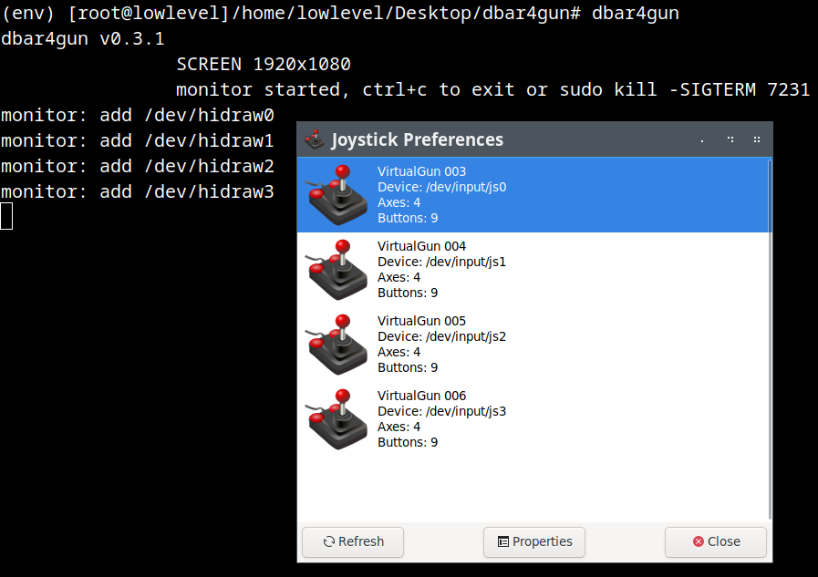

# dbar4gun 0.3.3

dbar4gun is a Linux userspace driver for the DolphinBar x4 Wiimote, specifically designed to be small and function as 4 light guns.

## Feature support
- Only DolphinBar in mode 4
- N Mayflash Dolphinbar
- 4 wiimote x Dolphinbar
- wiimote with individual buttons
- wiimote led -> index mouse
- working in linux
- working in retropie
- working in raspbian

## Installing without Docker
### System dependencies
- git
- python
### Python dependencies
- evdev>=0.3.0
- pyudev>=0.16

### Steps with root
#### build
~~~
cd dbar4gun
python -m venv env
source env/bin/activate
pip install .
~~~

### Use
#### run service with root
~~~
dbar4gun --width 1920 --height 1080
~~~

## To Do

1. Docker Version
2. Update README
3. Smoothed axes
4. Support nunchuck
5. Class Manage Device

## Installing with Docker (it does not work)
### Dependencies
- git
- docker or podman

### Steps
#### build
~~~
git clone https://github.com/lowlevel-1989/dbar4gun.git
docker build -t dbar4gun:0.3.2 dbar4gun
~~~

### Use
#### run service
~~~
docker container run --name dbar4gun -d --restart unless-stopped --privileged dbar4gun:0.3.2 --width 1920 --height 1080
~~~
#### stop
~~~
docker container stop dbar4gun
~~~
#### remove
~~~
docker container rm dbar4gun
~~~
#### logs
~~~
docker container logs dbar4gun
~~~

## References

The wiimote report format is not open and had to be reverse engineered. These resources have been very helpful when creating dbar4gun:

- <https://www.wiibrew.org/wiki/Wiimote>
- <https://github.com/xwiimote/xwiimote/blob/master/doc/PROTOCOL>
